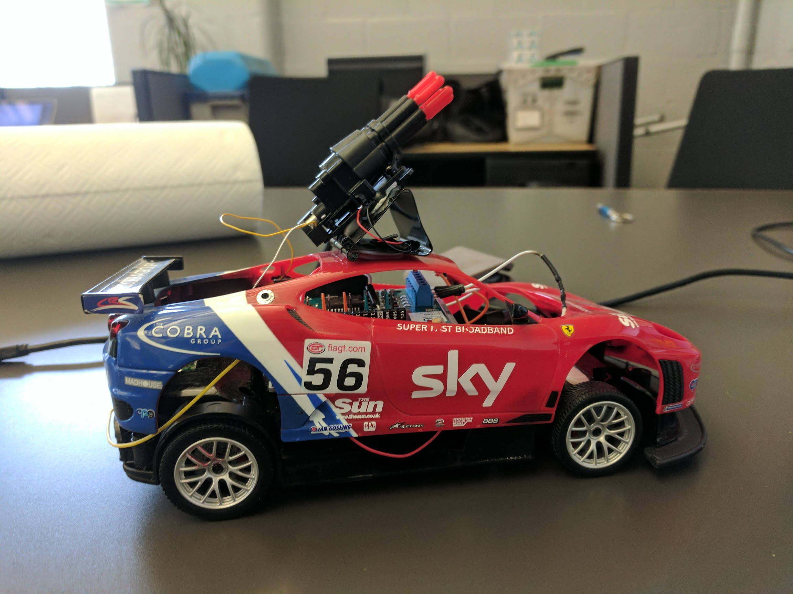
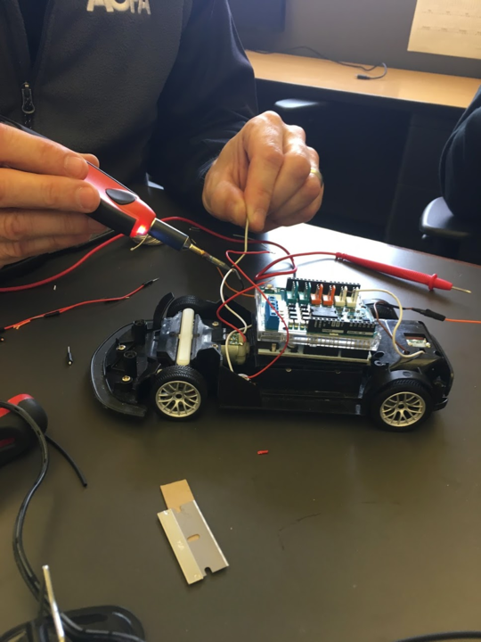

# hackTime - redRocket :rocket: :red_car:

## Problem:
It is not possible to shoot team members with plastic darts while working remotely.

## Proposed Solution:
Making a cheap 'off-the-shelf' red Ferrari RC car that can create a web interface over WiFi that allows it to be driven around and shoot out plastic rockets from any browser.

## Parts Required:
1. Red Ferrari RC Car
2. LinkSprite - LinkNode D1 (WeMo D1 - Based on ESP8266)
3. Arduino Motor Shield R3
4. Plastic Rocket Launcher with Rockets

## Connect to Arduino via Serial:

* Install FTDI drivers
    * [https://cdn.sparkfun.com/assets/learn_tutorials/7/4/FTDIUSBSerialDriver_v2_3.dmg](https://cdn.sparkfun.com/assets/learn_tutorials/7/4/FTDIUSBSerialDriver_v2_3.dmg)

* Arduino IDE   
    * Install the Arduino IDE from the Arduino website.
        * [https://www.arduino.cc/en/Main/ArduinoMotorShieldR3](https://www.arduino.cc/en/Main/ArduinoMotorShieldR3)
    * Start Arduino and open Preferences window.
    * Add the following into into the Additional Board Manager URLs field:
        * [http://arduino.esp8266.com/stable/package_esp8266com_index.json](http://arduino.esp8266.com/stable/package_esp8266com_index.json)
    * Open Boards Manager from Tools > Board menu and install esp8266 platform.
    * Select the ( WeMos D1(Retired)) ESP8266 board from Tools > Board menu after installation.
    * Connect LinkNode D1 to your PC.
    * Confirm the connection using the Serial Monitor.
    * _See -> [http://linksprite.com/wiki/index.php5?title=LinkNode_D1](http://linksprite.com/wiki/index.php5?title=LinkNode_D1) for more details._

## Steps Used to Connect to RedRocket via WiFi: 
* Use Arduino Serial Monitor to see IP address it pulled from DHCP
    * _e.g. 10.140.132.179_
* Connect to IP on port 80
    * http://10.140.132.179:80/